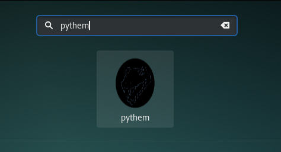

[](https://blockchain.info/address/1Eggia3JXwWiR4mkVqztionNUfs2N3ghAd)


# pythem - Penetration Testing Framework

pythem is a multi-purpose pentest framework written in Python. It has been developed to be used by security researchers and security professionals. The tool intended to be used only for acts within the law. I am not liable for any undue and unlawful act practiced by this tool, for more information, read the license. Only runs on GNU/Linux OS.


[](https://github.com/m4n3dw0lf/pythem/wiki)
## Installation

- [Installation guide](https://github.com/m4n3dw0lf/pythem/wiki/Installation#installation)

- [Create a global executable on PATH](https://github.com/m4n3dw0lf/pythem/wiki/Installation#create-a-global-executable-on-path)

- [Create a Desktop Shortcut](https://github.com/m4n3dw0lf/pythem/wiki/Installation#create-a-desktop-shortcut)



#### Quick-Start
```
sudo apt-get update
sudo apt-get install build-essential python-dev tcpdump python-capstone
sudo apt-get install libnetfilter-queue-dev libffi-dev libssl-dev
sudo git clone https://github.com/m4n3dw0lf/pythem
cd pythem
sudo pip install -r requirements.txt
chmod +x pythem.py
```
> Run with:
```
./pythem.py
```

## Examples

- [ARP spoofing - Man-in-the-middle](https://github.com/m4n3dw0lf/pythem/wiki/Examples#arp-spoofing---man-in-the-middle).
- [Man-in-the-middle HSTS bypass - Strip SSL](https://github.com/m4n3dw0lf/pythem/wiki/Examples#man-in-the-middle-hsts-bypass---strip-ssl)
- [ARP+DNS spoof - fake page redirect to credential harvester](https://github.com/m4n3dw0lf/pythem/wiki/Examples#arpdns-spoof---fake-page-redirect-to-credential-harvester)
- [DHCP ACK Injection spoofing - Man-in-the-middle](https://github.com/m4n3dw0lf/pythem/wiki/Examples#man-in-the-middle-dhcp-spoofing---dhcp-ack-injection)
- [Man-in-the-middle inject BeEF hook](https://github.com/m4n3dw0lf/pythem/wiki/Examples#inject-beef-hook)
- [SSH Brute-Force attack](https://github.com/m4n3dw0lf/pythem/wiki/Examples#ssh-brute-force-attack).
- [Web page formulary brute-force](https://github.com/m4n3dw0lf/pythem/wiki/Examples#web-page-formulary-brute-force)
- [URL content buster](https://github.com/m4n3dw0lf/pythem/wiki/Examples#url-content-buster)
- [Overthrow the DNS of LAN range/IP address](https://github.com/m4n3dw0lf/pythem/wiki/Examples#overthrow-the-dns-of-lan-rangeip-address)
- [Redirect all possible DNS queries to host](https://github.com/m4n3dw0lf/pythem/wiki/Examples#redirect-all-possible-dns-queries-to-host)

## Exploit Development with pythem

- [Exploit Development 1: Overwriting Instruction Pointer](https://github.com/m4n3dw0lf/pythem/wiki/Exploit-development#exploit-development-1-overwriting-instruction-pointer)
- [Exploit Development 2: Ret2libc](https://github.com/m4n3dw0lf/pythem/wiki/Exploit-development#exploit-development-2-ret2libc)

## Commands Reference

### Index

#### Core
  - [help](https://github.com/m4n3dw0lf/pythem/wiki/Commands-Reference#help)
  - [exit/quit](https://github.com/m4n3dw0lf/pythem/wiki/Commands-Reference#exitquit)
  - [set](https://github.com/m4n3dw0lf/pythem/wiki/Commands-Reference#set)
  - [print](https://github.com/m4n3dw0lf/pythem/wiki/Commands-Reference#print)

#### Network, Man-in-the-middle and Denial of service (DOS)<br>
  - [arpspoof](https://github.com/m4n3dw0lf/pythem/wiki/Commands-Reference#arpspoof)
  - [dhcpspoof](https://github.com/m4n3dw0lf/pythem/wiki/Commands-Reference#dhcpspoof)
  - [dnsspoof](https://github.com/m4n3dw0lf/pythem/wiki/Commands-Reference#dnsspoof)
  - [hstsbypass](https://github.com/m4n3dw0lf/pythem/wiki/Commands-Reference#hstsbypass)
  - [redirect](https://github.com/m4n3dw0lf/pythem/wiki/Commands-Reference#redirect)
  - [sniff](https://github.com/m4n3dw0lf/pythem/wiki/Commands-Reference#sniff)
  - [dos](https://github.com/m4n3dw0lf/pythem/wiki/Commands-Reference#dos)
  - [pforensic](https://github.com/m4n3dw0lf/pythem/wiki/Commands-Reference#pforensic)
    <br>**pforensic: Commands Reference**<br>
    - [help](https://github.com/m4n3dw0lf/pythem/wiki/Commands-Reference#help-1)
    - [clear](https://github.com/m4n3dw0lf/pythem/wiki/Commands-Reference#clear)
    - [exit/quit](https://github.com/m4n3dw0lf/pythem/wiki/Commands-Reference#exitquit-1)
    - [show](https://github.com/m4n3dw0lf/pythem/wiki/Commands-Reference#show)
    - [conversations](https://github.com/m4n3dw0lf/pythem/wiki/Commands-Reference#conversations)
    - [packetdisplay](https://github.com/m4n3dw0lf/pythem/wiki/Commands-Reference#packetdisplay-num)
    - [filter](https://github.com/m4n3dw0lf/pythem/wiki/Commands-Reference#filter-stringlayer)

#### Exploit development and Reverse Engineering<br>
  - [xploit](https://github.com/m4n3dw0lf/pythem/wiki/Commands-Reference#xploit)
    <br>**xploit: Commands Reference**<br>
    - [help](https://github.com/m4n3dw0lf/pythem/wiki/Commands-Reference#help-2)
    - [clear](https://github.com/m4n3dw0lf/pythem/wiki/Commands-Reference#clear-1)
    - [exit/quit](https://github.com/m4n3dw0lf/pythem/wiki/Commands-Reference#exitquit-2)
    - [set](https://github.com/m4n3dw0lf/pythem/wiki/Commands-Reference#set-1)
    - [decode/encode](https://github.com/m4n3dw0lf/pythem/wiki/Commands-Reference#decodeencode)
    - [shellcode](https://github.com/m4n3dw0lf/pythem/wiki/Commands-Reference#shellcode)
    - [search](https://github.com/m4n3dw0lf/pythem/wiki/Commands-Reference#search)
    - [xploit](https://github.com/m4n3dw0lf/pythem/wiki/Commands-Reference#xploit-1)
    - [cheatsheet](https://github.com/m4n3dw0lf/pythem/wiki/Commands-Reference#cheatsheet)
    - [fuzz](https://github.com/m4n3dw0lf/pythem/wiki/Commands-Reference#fuzz)
#### Brute Force<br>
  - [brute](https://github.com/m4n3dw0lf/pythem/wiki/Commands-Reference#brute)

#### Utils<br>
  - [geoip](https://github.com/m4n3dw0lf/pythem/wiki/Commands-Reference#geoip)
  - [decode/encode](https://github.com/m4n3dw0lf/pythem/wiki/Commands-Reference#decodeencode-1)
  - [cookiedecode](https://github.com/m4n3dw0lf/pythem/wiki/Commands-Reference#cookiedecode)
