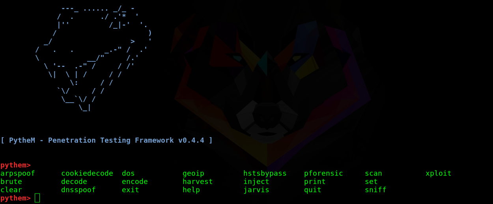

# PytheM - Penetration Testing Framework v0.6.8

PytheM is a python multi-purpose pentest framework. It has been developed in the hope that it will be useful and I don't take responsibility for any misapplication of it. Only runs on GNU/Linux OS.

## Installation

- [Installation guide](https://github.com/m4n3dw0lf/PytheM/wiki/Installation#installation)

## Examples

- [ARP spoofing - Man-in-the-middle](https://github.com/m4n3dw0lf/PytheM/wiki/Examples#arp-spoofing---man-in-the-middle).
- [Man-in-the-middle HSTS bypass - Strip SSL](https://github.com/m4n3dw0lf/PytheM/wiki/Examples#man-in-the-middle-hsts-bypass---strip-ssl)
- [ARP+DNS spoof - fake page redirect to credential harvester](https://github.com/m4n3dw0lf/PytheM/wiki/Examples#arpdns-spoof---fake-page-redirect-to-credential-harvester)
- [DHCP ACK Injection spoofing - Man-in-the-middle](https://github.com/m4n3dw0lf/PytheM/wiki/Examples#man-in-the-middle-dhcp-spoofing---dhcp-ack-injection)
- [Man-in-the-middle inject BeEF hook](https://github.com/m4n3dw0lf/PytheM/wiki/Examples#inject-beef-hook)
- [SSH Brute-Force attack](https://github.com/m4n3dw0lf/PytheM/wiki/Examples#ssh-brute-force-attack).
- [Web page formulary brute-force](https://github.com/m4n3dw0lf/PytheM/wiki/Examples#web-page-formulary-brute-force)
- [URL content buster](https://github.com/m4n3dw0lf/PytheM/wiki/Examples#url-content-buster)
- [Overthrow the DNS of LAN range/IP address](https://github.com/m4n3dw0lf/PytheM/wiki/Examples#overthrow-the-dns-of-lan-rangeip-address)
- [Redirect all possible DNS queries to host](https://github.com/m4n3dw0lf/PytheM/wiki/Examples#redirect-all-possible-dns-queries-to-host)

## Exploit Development with PytheM

- [Exploit Development 1: Overwriting Instruction Pointer](https://github.com/m4n3dw0lf/PytheM/wiki/Exploit-development#exploit-development-1-overwriting-instruction-pointer)
- [Exploit Development 2: Ret2libc](https://github.com/m4n3dw0lf/PytheM/wiki/Exploit-development#exploit-development-2-ret2libc)

## Commands Reference

- [SECTION - CORE](https://github.com/m4n3dw0lf/PytheM/wiki/Commands-Reference#section---core)
- [SECTION - NETWORK, MAN-IN-THE-MIDDLE AND DENIAL OF SERVICE (DOS)](https://github.com/m4n3dw0lf/PytheM/wiki/Commands-Reference#section---network-man-in-the-middle-and-denial-of-service-dos)
 - [PFORENSIC COMMANDS REFERENCE](https://github.com/m4n3dw0lf/PytheM/wiki/Commands-Reference#pforensic-commands-reference)
- [SECTION - EXPLOIT DEVELOPMENT AND REVERSE ENGINEERING](https://github.com/m4n3dw0lf/PytheM/wiki/Commands-Reference#section---exploit-development-and-reverse-engineering)
 - [XPLOIT COMMANDS REFERENCE](https://github.com/m4n3dw0lf/PytheM/wiki/Commands-Reference#xploit-commands-reference)
- [SECTION - BRUTE-FORCE](https://github.com/m4n3dw0lf/PytheM/wiki/Commands-Reference#section---brute-force)
- [SECTION - UTILS](https://github.com/m4n3dw0lf/PytheM/wiki/Commands-Reference#section---utils)
