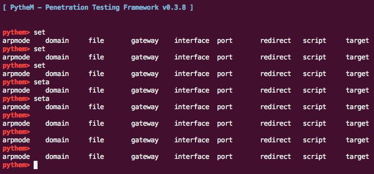

在`completer.py`里面，</br>

```python
# It should return the next possible completion starting with 'text'.
def pythem(self, text, state):

	#print text
	#print state
	# 只要按TAB键时，已经输入的字符串包含"set"，即便是"seta"也可以出现提示。
	if "set" in text and state == 1:
		self.suboptions = ['interface','arpmode','target','gateway','file','domain','port','script','redirect']
		completer = readline.set_completer(self.suboption)
```
这样写有点bug，就是只要按TAB键时，已经输入的字符串包含"set"，即便是"seta"也可以出现提示。</br>
而且，将前面的已经有的词清除之后留下空白，依然可以得到之前得到的提示。


`pythem> service ssh start`
这里的`service`并不在`interface.py`里的`self.input_list[0]`判断之列，应该是用的操作系统命令。
